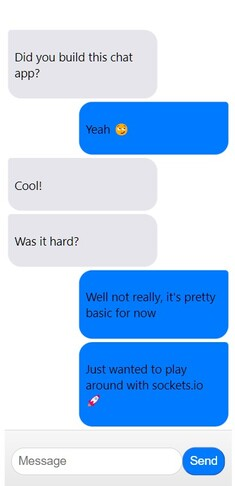

# Chat App

This is a real-time chat application built with Socket.IO, React, Express, and Node.js. Users can enter messages in the input field and send them to the server. The server then broadcasts the message to all connected clients, which display the message in the chat window.

## Technologies Used

-   [Vite](https://vitejs.dev/)
-   [TypeScript](https://www.typescriptlang.org/)
-   [React](https://reactjs.org/)
-   [Socket.IO](https://socket.io/)
-   [Express](https://expressjs.com/)
-   [Node.js](https://nodejs.org/)

## Running the App

To run the app, you need to start the server and the client.

### Running the Server

1. Navigate to the root directory of the project.
2. Install the dependencies by running `npm install`.
3. Start the server by running `npm start`.

### Running the Client

1. Navigate to the `client` directory of the project.
2. Install the dependencies by running `npm install`.
3. Start the client by running `npm start`.

## Usage

Once the server and client are running, navigate to `http://localhost:3000` in your browser. You should see the chat interface. Enter a message in the input field and hit the "Send" button or press enter to send the message to the server. The server will broadcast the message to all connected clients, which will display the message in the chat window.

## Credits

This project was created by Stephan Orgiazzi
